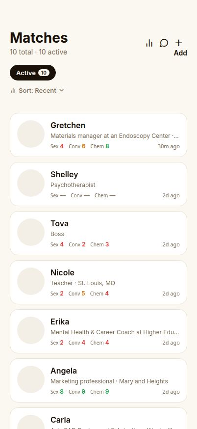
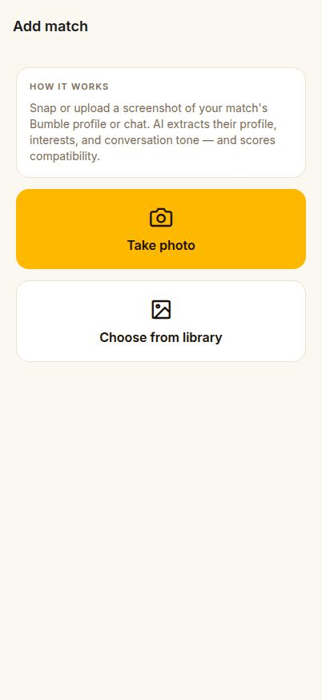
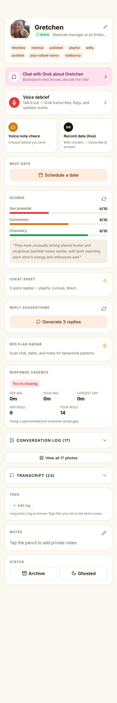
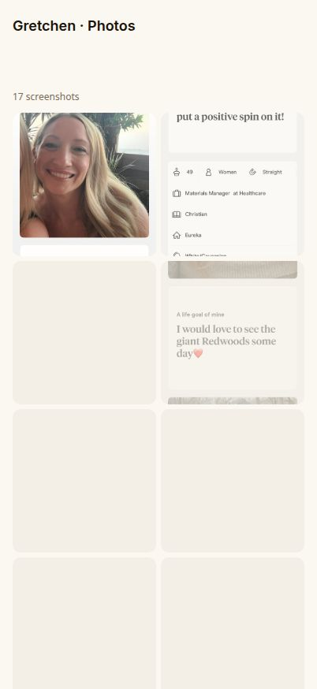
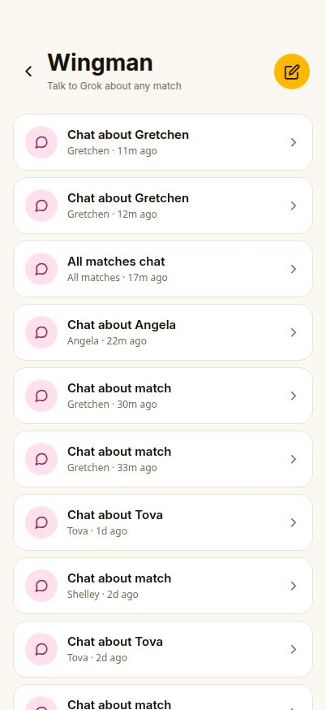
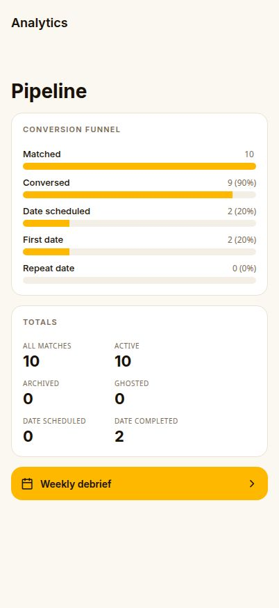
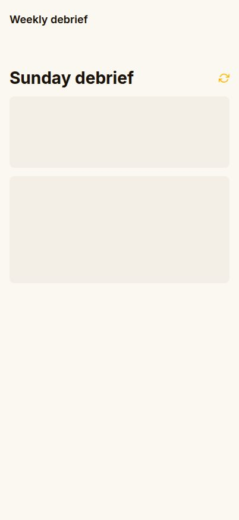

# Bumble CRM Mobile — Product Requirements Document

**Product:** Bumble CRM Mobile (Expo / React Native, ships to iOS, Android, and Web)
**Codename:** `bumble-mobile`
**Status:** Phase 3 shipped (May 25, 2026)
**Owner:** Solo operator workflow — "treat dating like a sales pipeline"

---

## 1. Problem

Dating apps are optimized for the platform, not the user. A power user juggling 10–30 simultaneous matches loses track of who said what, when to follow up, which conversations are stalling, and which dates are worth a second swing. The app's native UI gives you a chat thread and nothing else — no memory, no analytics, no coaching, no pipeline view.

## 2. Goal

A private, single-user CRM for Bumble that turns screenshots of matches into a structured pipeline with AI-assisted coaching at every stage: **scoring → conversation → date → debrief → re-engage or archive**.

The app never touches Bumble's servers. All input is screenshot- or voice-based. All intelligence runs through a single API server (`api-server`) that calls GPT-5.4 via the Replit OpenAI proxy.

## 3. Non-Goals

- No automated messaging on Bumble's behalf (TOS).
- No native-only iOS surfaces in this phase (share extension, home-screen widget, push delivery — deferred).
- No multi-user / social features.

---

## 4. Users & Core Loop

**Persona:** One user. High match volume. Wants fewer dead-ends and more second dates.

**Daily loop:**
1. Snap a screenshot of a new match → app extracts profile + scores.
2. Snap chat screenshots as they accumulate → transcript builds.
3. When a date is scheduled → AI prep brief + outfit note + calendar reminder.
4. Day-after → voice debrief; transcript and recap saved.
5. Weekly Sunday → "Sunday debrief" tells you what to do this week.

---

## 5. Information Architecture

```
/                       Matches list (home)
/add                    Add match (camera / library)
/match/[id]             Match detail (the big screen)
/match/[id]/photos      Photo gallery for one match
/chat                   "Wingman" — Grok chats about any match
/chat/[id]              Single conversation thread
/analytics              Conversion funnel + totals
/weekly                 Sunday debrief (AI weekly recap)
```

---

## 6. Feature Inventory (all phases)

### 6.1 Matches list — `/`



- Sortable list: **Recent**, Sex potential, Conversion, Chemistry, Name.
- Status filter chips: **Active / Archived / Ghosted** with live counts.
- **Tag filter chips** (Phase 3): every user-added tag becomes a `#tag` chip. Tap to filter; tap again to clear.
- Per-row preview: avatar, name, one-line bio, last activity ("30m ago"), three score badges (Sex / Conv / Chem) colored by value.
- **Auto-archive banner** (Phase 3): when a match has gone cold (no activity > N days, no scheduled date), a dismissible banner offers one-tap **Archive** or **Mark ghosted**.
- **Stale nudges**: AI-generated re-engagement suggestions surfaced for active matches that have stalled.
- Header actions: **Analytics** (bar chart icon), **Wingman** (chat icon), **Add** (+).

### 6.2 Add match — `/add`



- Two entry points: **Take photo** (camera) or **Choose from library**.
- On upload:
  1. Screenshot uploaded to object storage.
  2. Server calls GPT-5.4 vision to extract: name, bio, age, occupation, city, prompts, vibe tags.
  3. Initial scores generated: **Sex potential / Conversion / Chemistry** (0–10).
  4. Match row created and surfaced at the top of the list.

### 6.3 Match detail — `/match/[id]`



This is the core surface. Cards from top to bottom:

#### Header
- Avatar, name, status pill (Active/Archived/Ghosted), bio, vibe tags.
- Edit pencil → rename, change avatar.

#### Wingman shortcut
- "Chat with Grok about [name]" — opens a per-match AI thread that has all context (transcript, scores, dates, notes).

#### Voice surfaces
- **Voice debrief** — long voice note, Whisper transcription, AI updates scores + flags.
- **Voice note check** — critique a draft voice note before sending.
- **Record date (live)** — with-consent live transcription during a date.

#### Date scheduling
- **Schedule a date** card → time + location + **outfit note** (Phase 3).
- Once scheduled, becomes a **Next date** card showing date/time, location, and an outfit pill ("Outfit: black turtleneck + boots").
- Buttons: **AI prep brief** (GPT-5.4 summary of everything we know + ice-breakers), **Add to calendar**, **Reschedule**.
- The prep brief is **persisted on the match** (not ephemeral local state) and carries a freshness pill. It flips to amber-stale with a reason whenever (a) a new screenshot finishes extraction, (b) any date-related context changes — past-date log, upcoming-date time/location/outfit, or notes — or (c) the brief is more than 5 days old. The reason text tells you which one ("3 new screenshots since" / "Date details updated" / "Older than 5 days") so you know whether a regenerate is worth the tokens.
- Post-date: automatic "How did it go?" debrief card with quick recap input.

#### Scores
- Three bars (Sex / Conversion / Chemistry) with values + AI explanation paragraph.
- Refresh button re-runs scoring against latest transcript and notes.

#### Cheat sheet (Phase 3)
- Tap zap → GPT-5.4 returns **3 quick replies**: **Playful / Curious / Direct**, each tagged with style + icon.
- Tap any reply to copy to clipboard with haptic confirmation.
- Refresh to regenerate.

#### Reply suggestions
- One-shot **Generate 3 replies** button — longer-form alternatives tuned to recent message.

#### Red flag radar (Phase 3)
- Tap zap → AI scans transcript + dates + notes and returns:
  - **Red flags** with severity (low/med/high) and the evidence line.
  - **Green flags** with the evidence line.
  - **Overall read** — italic one-paragraph synthesis.
- Re-analyze on demand.

#### Response cadence (Phase 3)
- Status pill: **Balanced / You're chasing / She's chasing / Not enough data** (computed from screenshot upload gaps).
- Stats: her avg reply, your avg reply, longest gap from her, message counts both sides.

#### Conversation log + screenshots
- Collapsible list of all uploaded screenshots with extraction status.
- **View all N photos** button → opens the gallery screen.

#### Transcript
- Collapsible chronological transcript (extracted from screenshots).

#### Tags (Phase 3)
- Inline tag chips (lowercased). **Add tag** input. Long-press to remove.
- Tags drive home-screen filtering.

#### Notes
- Free-form private notes (pencil to edit).

#### Status actions
- **Archive** or **Mark ghosted** — moves out of active list.

### 6.4 Photo gallery — `/match/[id]/photos`



- 2- or 3-column grid (responsive on width).
- Header shows screenshot count.
- Per-tile badge for `extracting` / `failed` states.
- Tap a thumbnail (planned: lightbox; currently shows the still).

### 6.5 Wingman chat — `/chat`



- All AI threads in one place. Mix of per-match and "All matches" pipeline threads.
- Each thread is a full GPT-5.4 chat seeded with the relevant context.
- New chat button to start one against any match or the whole pipeline.
- Sub-route `/chat/[id]` is the conversation thread itself.

### 6.6 Analytics — `/analytics` (Phase 3)



- **Conversion funnel**: Matched → Conversed → Date scheduled → First date → Repeat date. Bars sized to max stage; per-stage % shown relative to top of funnel. (Stage math uses set-union so a match never double-counts.)
- **Totals** card: All / Active / Archived / Ghosted / Date scheduled / Date completed.
- **Weekly debrief** CTA (primary button) → `/weekly`.

### 6.7 Weekly debrief — `/weekly` (Phase 3)



- AI Sunday roll-up. GPT-5.4 ingests every active match's last week and outputs:
  - **Headline** + **summary** paragraph.
  - **Active count** + **new this week** count.
  - **This week's actions** — numbered, prescriptive ("Lock a time with Gretchen by Wednesday").
  - **Per match** rows with status pill (Heating up / Cold / Needs attention / Deprioritize / Steady), a one-line reason, tap-through to the match.
- Refresh icon re-runs the analysis.

---

## 7. AI Surface Map

| Surface | Model | Trigger | Input | Output |
|---|---|---|---|---|
| Profile extraction | GPT-5.4 vision | On screenshot upload | Image | Name, bio, vibe tags |
| Transcript extraction | GPT-5.4 vision | On chat screenshot upload | Image | Messages (her/you, text) |
| Scores | GPT-5.4 | After extraction or on demand | Profile + transcript + notes | 3 scores + explanation |
| AI prep brief | GPT-5.4 | Date day | Full match context | Conversation roadmap |
| Cheat sheet | GPT-5.4 | On demand button | Latest message + context | 3 replies (playful/curious/direct) |
| Reply suggestions | GPT-5.4 | On demand button | Same | 3 longer replies |
| Red flag radar | GPT-5.4 | On demand button | Transcript + dates + notes | Flags w/ severity + evidence |
| Voice debrief | gpt-4o-mini-transcribe + GPT-5.4 | Recording end | Audio | Transcript + score delta |
| Voice note check | Same | Recording end | Audio | Critique |
| Live date recording | Same | Recording end | Audio | Transcript + recap |
| Stale nudges | GPT-5.4 | Background on list view | All active matches | Re-engagement suggestions |
| Auto-archive candidates | Deterministic + reason text | List view | All matches | Cold-match list |
| Weekly debrief | GPT-5.4 | On demand | Last 7d across pipeline | Headline + actions + per-match status |
| Wingman threads | GPT-5.4 (multi-turn) | User chat | Seeded context | Conversational replies |

---

## 8. Data Model (core)

`matches`
- `id`, `name`, `bio`, `avatarObjectPath`, `status` (`active`|`archived`|`ghosted`)
- `vibeTags text[]`, `tags text[]` (Phase 3, user-controlled)
- `scores` (sex / conv / chem), `scoresExplanation`, `scoreHistory[]`
- `nextDateAt timestamptz`, `nextDateLocation text`, `nextDateOutfit text` (Phase 3)
- `dateHistory[]` ({ id, when, location, recap, createdAt })
- `lastDateBrief` jsonb — `{ brief, generatedAt, screenshotCountAt, contextHash }`. `contextHash` is a 16-char sha256 over the stable subset of date-related inputs (date history `when`/`location`/`recap`, next-date time/location/outfit, notes); the read path recomputes it to flip the pre-date brief between current and stale.
- `transcript[]`, `notes`, `createdAt`, `updatedAt`

`matchScreenshots` — { id, matchId, objectPath, extractionStatus }
`matchScoreHistory` — score-over-time series
`openrouterConversations` / `openrouterMessages` — Wingman threads
`voiceRecordings` — debrief / date / voice-note-check artifacts

## 9. API Surface (selected)

```
GET    /api/matches
GET    /api/matches/:id
PATCH  /api/matches/:id            // accepts tags, nextDateOutfit, status, scores, notes, ...
POST   /api/matches                // create from screenshot
GET    /api/matches/stale-nudges
GET    /api/matches/auto-archive-candidates       (Phase 3)
GET    /api/matches/weekly-debrief                (Phase 3)
GET    /api/matches/:id/date-brief
GET    /api/matches/:id/red-flags                 (Phase 3)
GET    /api/matches/:id/cheat-sheet               (Phase 3)
GET    /api/matches/:id/response-stats            (Phase 3)
GET    /api/matches/:id/replies
GET    /api/analytics/funnel                      (Phase 3)
POST   /api/voice/{debrief|date|note-check}       // multipart audio
GET/POST /api/openrouter/...                      // Wingman chat
GET    /api/storage/objects/:path                 // signed object serving
```

All route handlers register sub-paths **before** `/matches/:id` so the dynamic id doesn't swallow them. OpenAPI spec lives at `lib/api-spec/openapi.yaml`; clients (`@workspace/api-client-react` + `@workspace/api-zod`) are generated via orval.

---

## 10. Notifications & Reminders

- Local notification scheduled for **9am on date day** (cancelled if date is rescheduled / cleared).
- Post-date debrief card appears automatically once the scheduled time has passed.
- **Push delivery is not in this phase** — requires a dev build outside Expo Go.

---

## 11. Phases Shipped

**Phase 1** — Foundations: match list, add match, profile/transcript extraction, scores, notes, archive, screenshots.
**Phase 2** — Coaching depth: voice debriefs, voice note check, live date recording, AI prep brief, reply suggestions, calendar/date-day reminders, Wingman chat (per-match + pipeline-wide), stale nudges.
**Phase 3** — Operator mode (this PRD's deliverable):
  - Weekly debrief
  - Red flag radar
  - Cheat sheet
  - Photo gallery screen
  - Tags + home filter
  - Auto-archive prompts
  - Conversion funnel analytics
  - Response-time cadence analyzer
  - Outfit note on scheduled dates

**Explicitly deferred** — iOS share extension, home-screen widget, push notifications. All require a custom dev client.

---

## 12. Open Questions / Next

1. **Photo lightbox** — current gallery shows the still; add full-screen swipe view.
2. **Cross-screen cache invalidation** — PATCH currently refetches the match detail locally; analytics / weekly / home would benefit from explicit `queryClient.invalidateQueries` on the relevant keys.
3. **Cheat-sheet / red-flag caching** — currently re-runs each tap. The pre-date brief now persists with a context-hash freshness check; extend the same pattern to cheat sheet and red flag radar to save tokens.
4. **Tag suggestions** — auto-suggest tags from vibe analysis.
5. **Funnel by cohort** — split funnel by week or by tag to see what's working.
6. **Native dev build** — unblocks push, widgets, share extension for Phase 4.

---

## 13. Tech Stack

- **Mobile:** Expo SDK (Router 6, Image, AV→Audio, Notifications, Haptics, Camera, Clipboard).
- **State/data:** TanStack Query via generated `@workspace/api-client-react`.
- **Backend:** Fastify (`@workspace/api-server`), Drizzle ORM on Postgres.
- **AI:** GPT-5.4 chat + vision, `gpt-4o-mini-transcribe` for audio, all through `@workspace/integrations-openai-ai-server` (Replit AI Integrations proxy — no per-user keys).
- **Object storage:** Replit App Storage via `/api/storage/objects/:path` signed serving.
- **Monorepo:** pnpm workspaces; OpenAPI-first contract via orval codegen.
